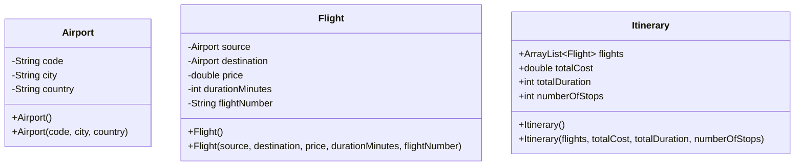

# System Structure

```plaintext
com.flight_routes.system
├── model
│   ├── Airport.java      (The Nodes)
│   └── Flight.java       (The Edges)
|   └── Itinerary.java    (Collection of flights)
├── service
│   ├── RouteMap.java     (The Graph Data Structure)
│   └── RouteFinder.java  (The Dijkstra Algorithm)
├── util
│   └── DataLoader.java (Airports, Flights helper method to extract data from CSV files)
│   └── Functions   (All methods used to display/generate flights report)
└── Main.java   (Entry Point)
└── airports.csv
└── flight_routes.csv
└── error.txt
└── report.txt
```

# Class Diagram




# Methods/Classes Proposal:
- Airport.java
	- equals
	- hashCode
	- toString
	- isValidCode
- Flight.java
	- GetWeight
	- isInternational
	- formattedDuration
- Itinerary.java (Optional)

	This class could be used in RouteFinder, returning an Itinerary object instead of just returning an ArrayList<Airport>.

	Constructure attributes:
	- flights: ArrayList<Flight>
	- totalCost: double
	- totalDuration: int
	- numberOfStops: int

- RouteMap.java
	- addFlight
	- getDirectConnections
	- hasRoute
	- getTotalAirportsCount
- RouterFinder.java
	- findCheapestRoute
	- findFastestRoute
	- reconstructPath
- DataLoader.java
	- getRawData
	- parseAirportData
	- parseFlightRoutesData
- Functions.java
	- loadSystem
	- displayRoutes
	- exportRouteReport
- sectionHeader
- Main.java
	
	```code
	Map<Airport, List<Flight>> routes = new HashMap<>();
	```
